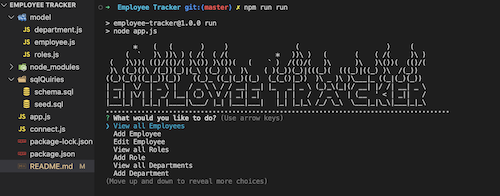

# Employee Tracker 

## Description 

Effortlessly handle your employee database using the convenience of your command line interface. Take advantage of intuitive command line prompts to seamlessly add, remove, and modify your employees on the go.

## Mock-Up

The following video shows an example of the application being used from the command line: {click picture}

[](https://drive.google.com/file/d/17D5Hv94PKchn_hMh3Mv4-4ffKdzAq_Tk/view)

## Table of contents:

* Title
* Description
* Installation
* Usage
* Author
* GitHb Link
* License

## Installation:

```bash
npm install console.table@^0.10.0 inquirer@^8.2.4 mysql2@^3.3.3
npm run run
```


## Usage
```
1.Install Dependencies:
Ensure that all required dependencies are installed by running the necessary commands.

2.Run npm run run:
Execute the command npm run run to initiate the program.

3.Navigate the Main Menu:
Scroll through the main menu options to explore the available functionalities.

4.Follow the Prompts:
Interact with the program by following the prompts displayed on the screen, guiding you through various actions and operations.
```

###

Written by Christian Alteri

To learn more about my project, [click here](https://github.com/ChristianAlteri/Employee-Tracker).

####

[](LICENSE)
